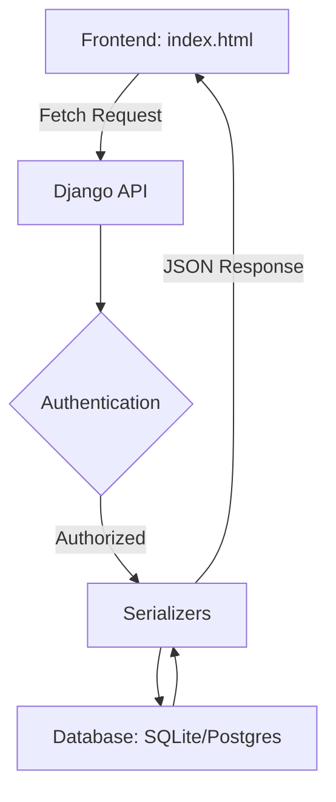

# 🛒 Ecommerce Backend Design - Professional API Marketplace

<div align="center">


**A modern, scalable e-commerce backend architecture designed for high-performance retail applications, featuring RESTful API design and seamless frontend integration.**

[Features](#-features) • [API Reference](#-api-reference) • [Installation](#-installation) • [Usage](#-usage) • [Tech Stack](#-tech-stack)

</div>

---

## 🌟 Features

### Product & Inventory Logic
- 📦 **Dynamic Product Catalog** - Managed products with categories, descriptions, and pricing.
- 🖼️ **Image Handling** - Integrated static and media file management for product displays.
- 🔍 **Filtered Retrieval** - Fetch products by category or specific attributes via API.

### Customer & Order Workflow
- 🛒 **Cart Management** - Real-time cart state persistence through API endpoints.
- 💳 **Order Processing** - Structured flow from cart validation to final order placement.
- 👤 **User Profiles** - Secure storage for customer details and order history.

### Platform Architecture
- 🔐 **Secure Authentication** - Token-based or Session authentication for protected routes.
- ⚡ **RESTful Design** - Completely decoupled backend allowing for any frontend (React, JS, Mobile).
- 🎨 **CORS Enabled** - Configured for cross-origin requests (essential for your local frontend).
- 📱 **Scalable Database** - Optimized SQLite configuration for development, ready for PostgreSQL.

---

## 🚀 Quick Start

### Prerequisites
- Python 3.12 or higher
- pip (Python package manager)
- Virtual environment (`venv`)

### Installation

1. **Clone the repository**
   ```bash
   git clone [https://github.com/salamlakhan7/ecommerce-backend-design..git](https://github.com/salamlakhan7/ecommerce-backend-design..git)
   cd ecommerce-backend-design/backend

```

2. **Create and activate virtual environment**
```bash
# Windows
python -m venv venv
.\venv\Scripts\activate

```


3. **Install dependencies**
```bash
pip install -r requirements.txt

```


4. **Run database migrations**
```bash
python manage.py makemigrations
python manage.py migrate

```


5. **Start the development server**
```bash
python manage.py runserver

```


6. **Access the application**
* API Root: `http://127.0.0.1:8000/`
* Admin Panel: `http://127.0.0.1:8000/admin`


---

## 📖 API Reference

| Endpoint | Method | Description |
| --- | --- | --- |
| `/api/products/` | `GET` | Fetch all products with details |
| `/api/categories/` | `GET` | List all available product categories |
| `/api/carts/` | `POST` | Create or update shopping cart items |
| `/api/orders/` | `POST` | Submit a checkout request |
| `/admin/` | `GET` | Management interface for inventory |

---

## 🛠️ Tech Stack

### Backend

* **Django 5.x** - High-level Python web framework.
* **Django REST Framework** - Powerful toolkit for building Web APIs.
* **Gunicorn** - Production-grade WSGI HTTP Server for Railway.
* **SQLite** - Default development database.

### Frontend

* **HTML5 & CSS3** - Modern, responsive structure.
* **JavaScript (ES6+)** - Fetch API for asynchronous backend communication.
* **Tailwind CSS** - Utility-first styling (as seen in `category.html`).

---

## 📁 Project Structure

```text
backend/
├── ecommerce/              # Product, Category, and Order Logic
│   ├── migrations/         # Database schema history
│   ├── models.py           # Core Data Structures
│   ├── serializers.py      # Data conversion to JSON
│   ├── views.py            # API ViewSets and Logic
│   └── urls.py             # App-specific routing
├── ecommerce_project/      # Main Settings and Root URLs
├── static/                 # CSS, JS, and Product Images
├── manage.py               # Django CLI tool
├── requirements.txt        # Python dependencies
└── Procfile                # Railway deployment config

```

---

## 🎨 Workflow Logic



---

## 🤝 Contributing

1. Fork the repository
2. Create your branch (`git checkout -b feature/AmazingFeature`)
3. Commit your changes (`git commit -m 'Add some AmazingFeature'`)
4. Push to the branch (`git push origin feature/AmazingFeature`)
5. Open a Pull Request

---

## 👥 Author

* **Abdul Salam** - *Backend Architect* - [salamlakhan7](https://github.com/salamlakhan7)

---

<div align="center">

**Made with ❤️ using Django REST Framework**

⭐ Star this repo if you find it helpful!

</div>

```

### Next Steps for you:

1.  **Paste** this into a new file named `README.md` in your `backend` folder.
2.  **Run** these commands to update GitHub:
    ```powershell
    git add README.md
    git commit -m "docs: add professional feature-rich readme"
    git push origin main
    ```
3.  **Week 3:** When you get your Railway URL, just update the `[PASTE_YOUR_RAILWAY_URL_HERE]` placeholder\!


```
